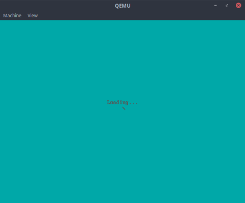

# asm-x86-game

Simple game meant to be run on a bare metal x86 system.  
It provides a nice example of a 2-stage bootloader along with a simple OS (the game itself), all written in x86 Intel assembly.  
Credits to [@PunishedBois](https://github.com/PunishedBois) for doing most of the work.

2nd Bootloader                                |  Game Kernel
:--------------------------------------------:|:----------------------------------------:
  |  
 

To play the game, simply press the space bar to avoid the obstacles.

## Requirements 

- `make`
- `nasm`
- `qemu`

Build and run with `make all`

